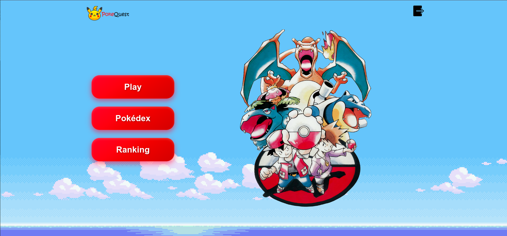

# Sistemas-Multiagentes

[link al dataset](https://0x0.st/XRDQ.0.csv/pokemon_dataset.csv)

<!--
  FIXME this link will expire in a year, ~nov-2025, 
  when we finish, save this dataset as an attachment, or just a 
  file in the final version 
--->

<!--
0x0.st token:
X-Expires: 1764372956622
X-Token: Bco0cck0xp8Be7qqWE_yFU4Ji-ZxxhKjkgzr2LEKQOQ
--->

This is a simple quiz game, about the properties of pokemons, with a leaderboard system, and an unlockable pokedex. In order to unlock a pokemon there, you only need to answer a correct question with the pokemon there (only the correct pokemon with the answer would be unlocked, not the other one)

## Screenshots





## Setup

This setup is very simple, all you need is docker, in order to set up all the containers.

You just need to run:

```bash
bash run.sh
```

## Lista de requisitos

### Requisitos funcionales

- El usuario debe ser capaz de crearse una cuenta.
- El usuario debe ser capaz de acceder a la aplicación con su nombre de usario y contraseña.
- La aplicación tendrá tres funcionalidades distintas:
  - Pokédex: El usuario puede ver toda la información sobre los distintos pokémons desbloqueados.
  - Quiz: Se pone al jugador a prueba con una serie de preguntas. Se termina si el jugador falla una pregunta. Una vez que se tenga un prototipo que genere preguntas en general se puede pensar en implementar distintos modos de juego. Las preguntas pueden ser de cualquier dato relacionado con el pokémon y tendrás que elegir entre 2 pokémons (como el conocido juego higher and lower).
  - Ranking: El usuario puede ver su posición en el ranking y el top global.
  - Se puede aplicar un modelo para predecir las estadísticas del usuario jugando. Tipo de pokémon que más acierta, predicción de aciertos en la próxima jugada..., hacer un dashboard de las estadísticas del jugador.
  
    ¿Qué consigue el usuario jugando?
    - Puntos para el ranking (esto se traduce en "medallas de gimnasio").
    - Desbloquea pokémons en la pokédex.